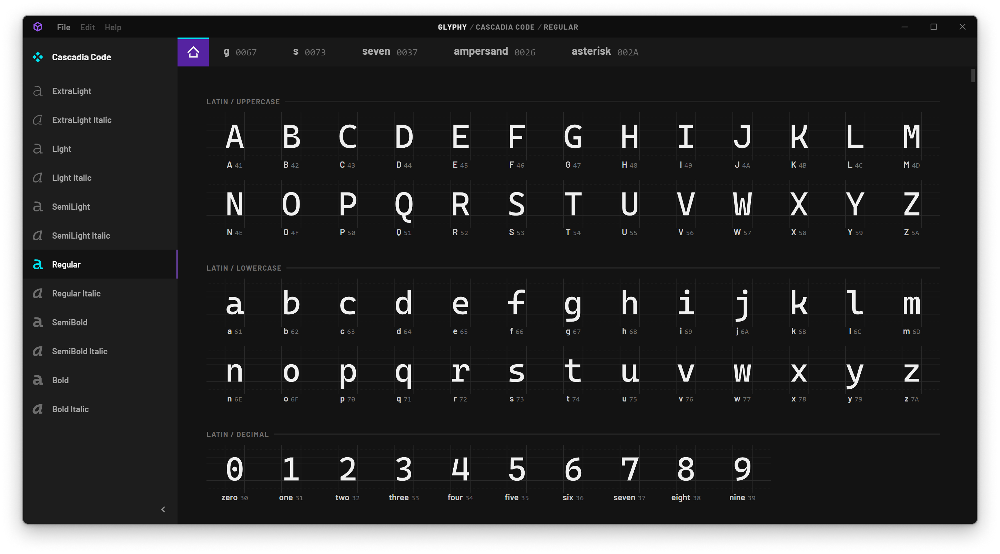
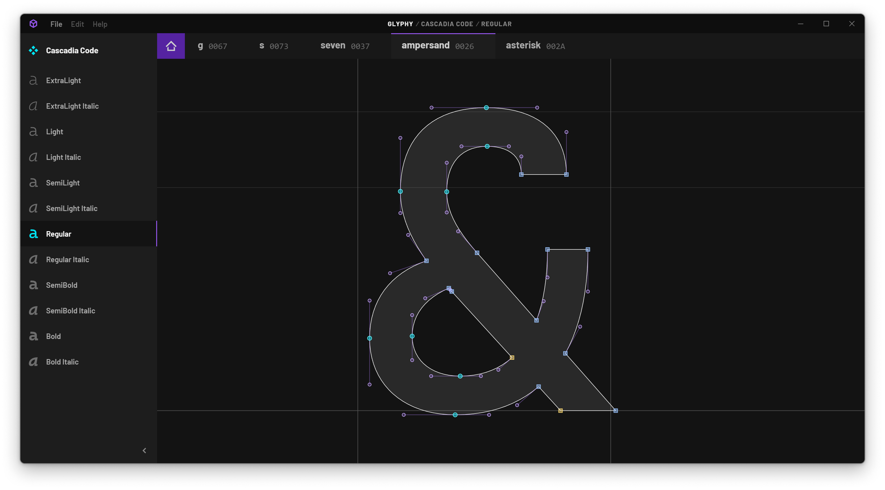

# Glyphy

Glyphy is (or will be) a cross-platform font editor with a modern design and a
streamlined user experience.

Type design is a very niche profession in the design industry currently, and I
suspect that's partially owing to how unintuitive (and expensive!) many of the
common tools of the trade are, especially if you're not on a Mac. I would love
to change that.

[](./meta/Glyphy_CascadiaCode_Home.png)
[](./meta/Glyphy_CascadiaCode_Ampersand.png)

## Status

This project is very, very work-in-progress &mdash; OTF fonts with PostScript
outlines can be imported, and you can toy around with some rudimentary Bezier
curve manipulation, but saving and exporting are not yet implemented.

## Take it for a spin

- [Install Rust](https://www.rust-lang.org/learn/get-started) if you don't already have it
- Install [Node.js LTS](https://nodejs.org/en) if you don't already have that
- Install dependencies:
```sh
npm install
```
- Run the app:
```sh
npx nx launch glyphy
```
