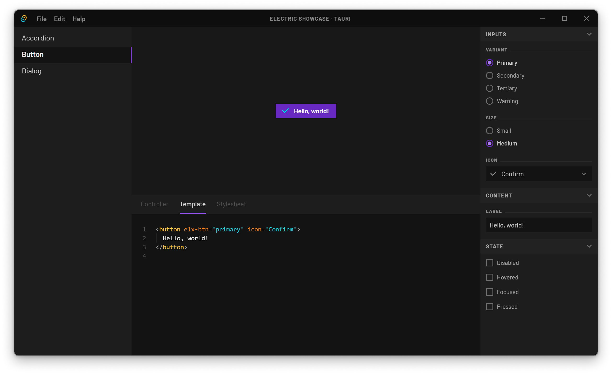

# Electric Showcase

This is a hand-built showcase application in the vein of Storybook, to demonstrate and test the features of `@electric/components`.

[](./meta/Showcase_TauriApp.png)

To be honest, building and maintaining this thing has not been trivial, so it's missing a lot of examples and is likely to drift out of date over time. I really need to investigate a more automated solution.

## Running the demo

In a web browser:
```sh
npx nx serve showcase --open
```

As a Tauri desktop application:
```sh
npx nx launch showcase
```
