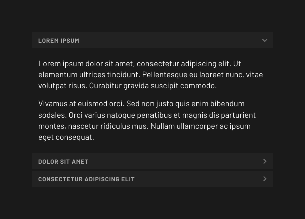

# Components / Accordion

## Import

```ts
import { AccordionModule } from "@electric/components/accordion";
// Or:
import { AccordionModule } from "@electric/components";
```

## Usage

```html
<elx-accordion-group>
	<elx-accordion expanded>
		<elx-accordion-header>Lorem Ipsum</elx-accordion-header>
		<p>
			Lorem ipsum dolor sit amet, consectetur adipiscing elit. Ut elementum
			ultrices tincidunt. Pellentesque eu laoreet nunc, vitae volutpat risus.
			Curabitur gravida suscipit commodo.
		</p>
		<p>
			Vivamus at euismod orci. Sed non justo quis enim bibendum sodales. Orci
			varius natoque penatibus et magnis dis parturient montes, nascetur
			ridiculus mus. Nullam ullamcorper ac ipsum eget consequat.
		</p>
	</elx-accordion>
	<elx-accordion>
		<elx-accordion-header>Dolor Sit Amet</elx-accordion-header>
		...
	</elx-accordion>
	<elx-accordion>
		<elx-accordion-header>Consectetur Adipiscing Elit</elx-accordion-header>
		...
	</elx-accordion>
</elx-accordion-group>
```

## Result


